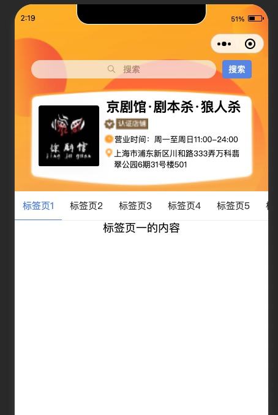
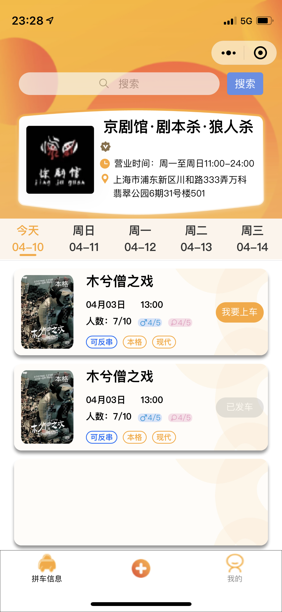
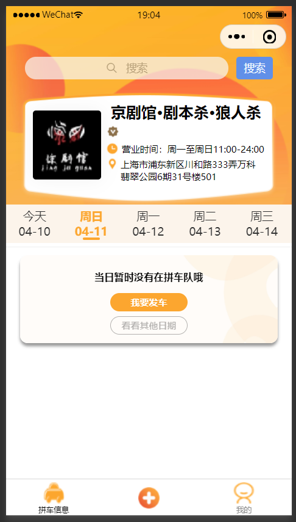
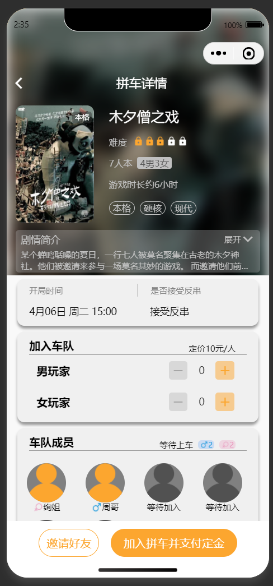
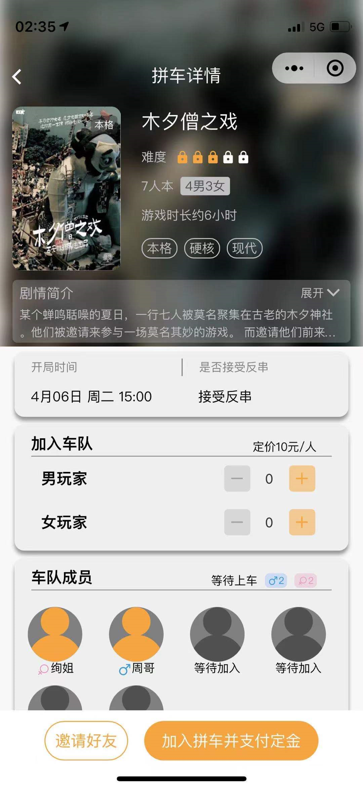
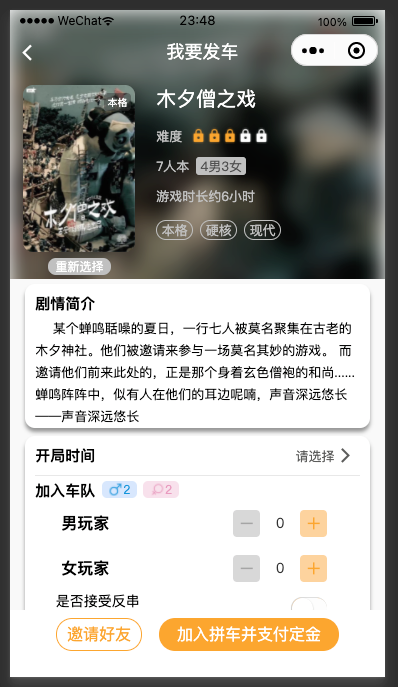

---

---

👽 Taro v3.2.1

  Taro CLI 3.2.1 environment info:

    System:
      OS: macOS 11.2.3
      Shell: 3.2.57 - /bin/bash
    Binaries:
      Node: 14.16.1 - /usr/local/bin/node
      npm: 6.14.12 - /usr/local/bin/npm
    npmPackages:
      @tarojs/cli: 3.2.1 => 3.2.1 
      @tarojs/components: 3.2.1 => 3.2.1 
      @tarojs/mini-runner: 3.2.1 => 3.2.1 
      @tarojs/react: 3.2.1 => 3.2.1 
      @tarojs/runtime: 3.2.1 => 3.2.1 
      @tarojs/taro: 3.2.1 => 3.2.1 
      @tarojs/webpack-runner: 3.2.1 => 3.2.1 
      babel-preset-taro: 3.2.1 => 3.2.1 
      eslint-config-taro: 3.2.1 => 3.2.1 
      react: ^17.0.0 => 17.0.2 
      taro-ui: ^3.0.0-alpha.3 => 3.0.0-alpha.10

Taro CLI 3.2.1 environment info (Windows):

    System:
      OS: Windows 10
    Binaries:
      Node: 14.16.1 - C:\Program Files\nodejs\node.EXE
      npm: 6.14.12 - C:\Program Files\nodejs\npm.CMD

# StoreInfo页面：

### 样例：

## 4月10日 开发进度

### 微信开发者工具:

### Iphone12 测试:

## 4月11日 开发进度

### 微信开发者工具：

### Iphone12测试：

### 当前页面的TODO List：

1. 日期栏需要重写组件，可以直接改taro UI里的AtTabs组件 ，再进行编译。 
   1. 目前没有实现当天如果没有车队，则显示灰色字体。
   2. 目前没有实现，选中日期右上角出现当天车队数目。
2. tabbar可以用自定义的，目前的tabbar图标大小不能改。

## 4月12日 开发进度

### 微信开发者工具：

### Iphone12测试：

# QueueInfo页面：

### 样例：

##  4月13日 开发进度：

### 微信开发者工具：

### Iphone12测试：

# JoinQueueSelect

### 样例：

这个页面需要微调，（待处理）

## 4月14日开发进度：

### 微信开发者工具：

.png)

### Iphone12 测试：

# JoinQueueComfirm

### 样例:

## 4月14日开发进度：

### 微信开发者工具:

### Iphone12 测试:

# ComfirmQueueInfo页面：

### 样例：

## 4月16日开发进度：

### 微信开发者工具：

### Iphone12 测试：

